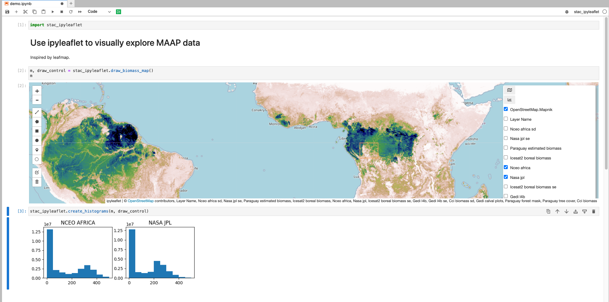

# STAC ipyleaflet

WORK IN PROGRESS. Right now this does nothing with STAC. Currently this provides a module on top of ipyleaflet demonstrating how to load tile layers (from `biomass-layers.csv` and create histograms from a bounding box and visible layers.



## Requirements

* python, pip, jupyter lab, virtualenv, node>=12.0.0

## Setup

For demo purposes, `write_biomass_layers.py` is a script which requires
```sh
conda create -n stac_ipyleaflet python=3.9
conda activate stac_ipyleaflet
pip install -r requirements.text
python -m ipykernel install --name=stac_ipyleaflet
export AWS_PROFILE=maap
jupyter lab
```

Note this library currently includes `rio.open` so must be run with an AWS identity that has access to the bucket the biomass products are in.

